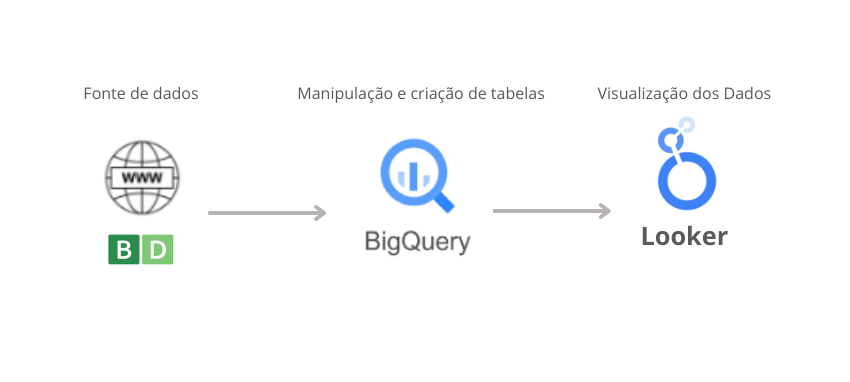
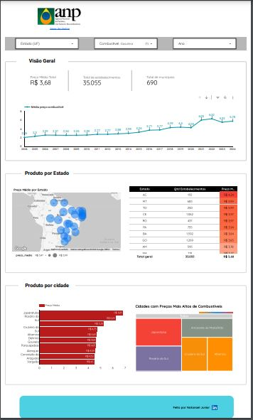
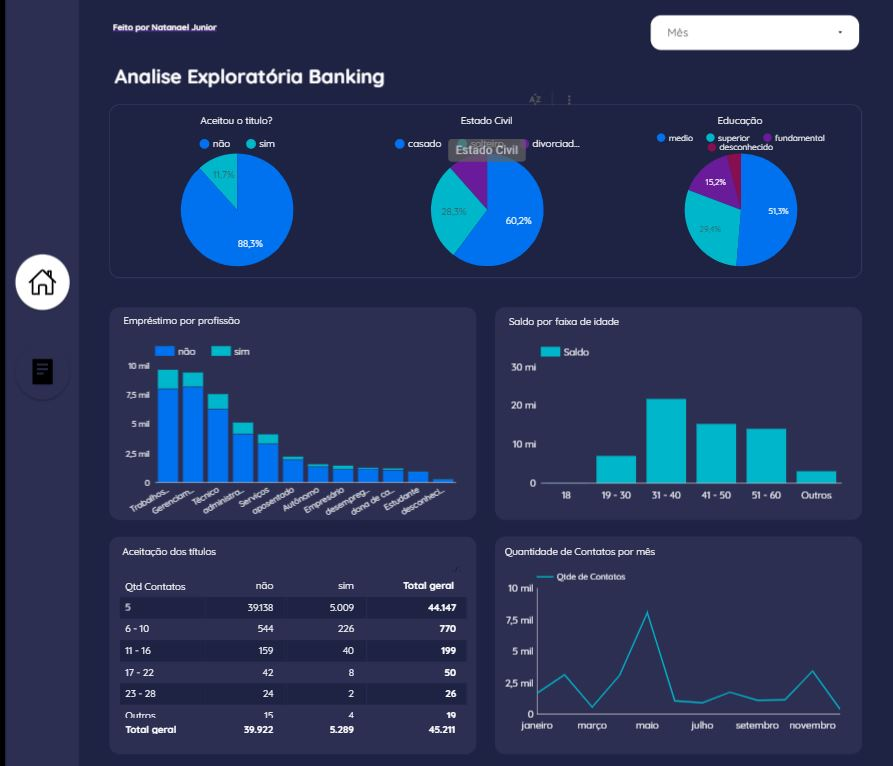

<h1>Dashboard Preços de Combustíveis</h1>

Dashboard criado usando uma base de dados da plataforma https://basedosdados.org/. "Preços de Combustíveis" uma pesquisa feita pela a ANP. Como proprio site descreve.

<h2>Pilha de tecnologia</h2>

As seguintes tecnologias usadas

<ul>
  <li>basedosdados.org/ - como Data Lake</li>
  <li>Google BigQuery - para Data Warehouse</li>
  <li>Estudio Google Looker - para visualizações</li>
</ul>

<h2>Arquitetura</h2>

<h2>Dashboard</h2>

Para conferir, <a href='https://lookerstudio.google.com/reporting/6d604d4b-d22e-4c9e-89e2-924d1f193277' target="_blank">clique aqui</a>

<h1>Dashboard Analise Exploratória Banking</h1>

Usando um exercicio de um curso de Power Bi, tive como objetivo criar o painel usando o Looker Studio ao invés de outra ferramenta

<h2>Pilha de tecnologia</h2>

As seguintes tecnologias usadas

<ul>
  <li>Excel - como Armazamento da base/planilha</li>
  <li>Estudio Google Looker - para visualizações</li>
</ul>

<h2>Arquitetura</h2>

